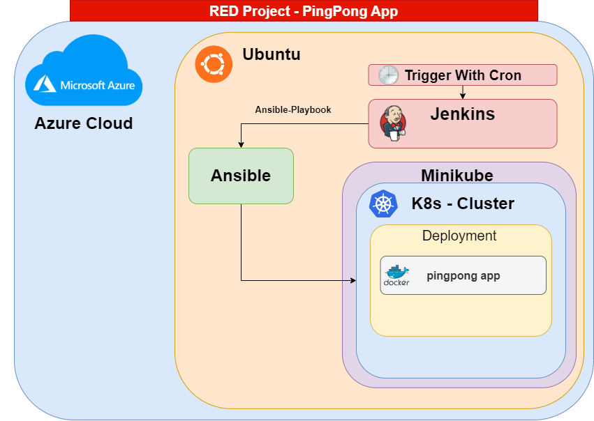

# RED PROJECT

## Team Members:
- Omri Yahav: omriyx@gmail.com 
- Eliraz Oved: ovedeliraz96@gmail.com

## Institute:
Bar Ilan University 🎓

## Project Description
DevSecOps Final Project (RED)

1 - BUILD A PYTHON FLASK APP WITH A PING-PONG FUNCTION A PING PONG FUNCTION IS A GET FUNCTION THAT RECEIVES THE GET REQUEST AS A SERVER THE BODY OF THIS REQUEST IS A JSON WITH A CONTENT PING THE FLAK APP SHROUD RETURNS A 200 RESPONSE WITH A PONG JSON

2 - BUILD AN IMAGE THAT RUNS THE APPLICATION IN PORT 5005

3 - BUILD A CLUSTER IN MINIKUBE TO RUN 4 INSTANCES OF THIS CONTAINER

4 - THE INSTANCE SHOULD BE A DEPLOYMENT WITH A 4 REPLICAS USING ANSIBILE BUILD A CRON JOB IN JENKINS TO ADD 2 REPLICAS AT 8:00 AND DELETE 2 REPLICAS AT 13:00


## Project Architecture



## Installation

1. Make sure you have Docker installed on your system.

2. Clone this repository to your local machine using the following command:

   ```bash
   git clone https://github.com/OmriYahav/-BIU-FinalProject
   ```

3. Change to the project directory:

   ```bash
   cd -BIU-FinalProject
   ```

4. Build the Docker image:

   ```bash
   docker build -t pingpong-app .
   ```

5. Run the Docker container:

   ```bash
   docker run -d -p 5005:5005 pingpong-app
   ```

## Usage

1. The application is now running inside a Docker container on `http://192.168.49.2:5005/ping`.

2. Send a GET request to `http://192.168.49.2:5005/ping` with a JSON body containing a 'content' key and the value 'ping'. For example:

   ```bash
   curl -X GET -H "Content-Type: application/json" -d '{"content": "ping"}' http://192.168.49.2:5005/ping
   ```

3. The application will respond with a JSON containing a 'message' key and the value 'pong'.

   ```
   {"message": "pong"}
   ```


